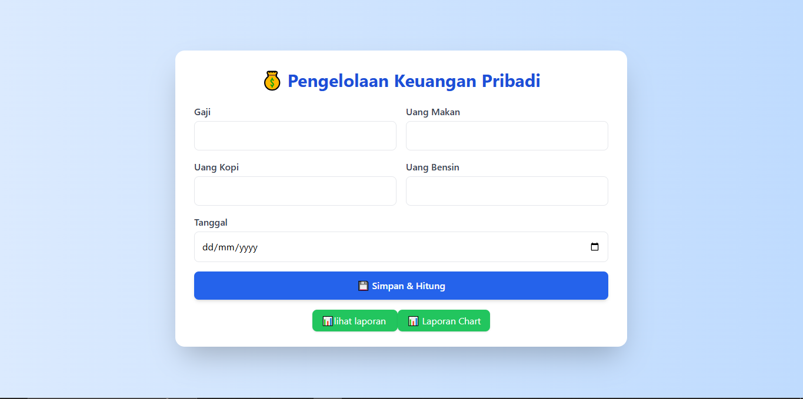
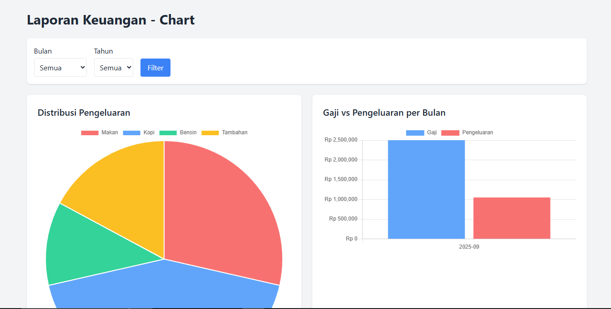

# Aplikasi Pengelolaan Keuangan Pribadi 💰

Proyek ini adalah aplikasi berbasis **PHP + MySQL** dengan tampilan modern menggunakan **Tailwind CSS** dan **Chart.js** untuk membantu mengelola keuangan pribadi bulanan.

## 📊 Demo Screenshots

### Dashboard


### Laporan Chart


## ✨ Fitur Utama
- Input transaksi (gaji, makan, kopi, bensin, dan pengeluaran tambahan).
- Laporan transaksi dalam bentuk tabel.
- Target tabungan dengan manajemen periode.
- Laporan chart (Pie, Bar, Line) untuk analisis keuangan:
  - Distribusi pengeluaran.
  - Perbandingan gaji vs pengeluaran.
  - Perkembangan sisa tabungan.
- Export laporan ke PDF menggunakan **FPDF**.
- CRUD data transaksi & target tabungan.

## 🗄️ Struktur Database
- **transaksi**: menyimpan data gaji dan pengeluaran utama.  
- **pengeluaran**: menyimpan kategori pengeluaran tambahan per transaksi.  
- **target_tabungan**: menyimpan target tabungan dengan periode waktu tertentu.  

## 🛠️ Teknologi yang Digunakan
- **PHP** (Native, tanpa framework)
- **MySQL** (Database)
- **Tailwind CSS** (UI)
- **Chart.js** (Visualisasi data)
- **FPDF** (Export PDF)
- **XAMPP** sebagai local server (PHP + MySQL)

## 🚀 Cara Menjalankan
1. Clone repository ini:
   ```bash
   git clone https://github.com/username/keuangan-pribadi.git
